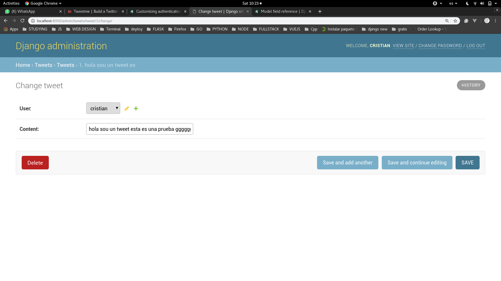

# Django asociar un usuario con un Tweet

Entonces lo que queremos es dar la siguiente logica:

Soy un usuario logeado y quiero escribir un tweet el cual debera estar asociado a mi nombre de usuario y demas. Y para esto vamos a aprender a usar una llave foranea (**ForeignKey**). Una llave forenea conecta diferentes modelos entre si. Esto puede sonar confuso pero la idea central sera que vamos a **crear una relacion entre 2 modelos**.

Vamos a usar la informacion del siguiente [link](https://docs.djangoproject.com/es/2.1/ref/models/fields/#foreignkey)

## Ahora vamos a hablar un poco de la ForeignKey de Django

Esta establece una relacion de many-to-one (varios a uno). Y requiere dos argumentos necesarios **la clase con la que esta relacionada** y la opcion **on_delete** que veremos luego (pero es para cuando querramos eliminar).

DATO:

Tambien se puede crear una relacion reecursiva hacia si mismo. Usando lo siguiente: **models.ForeignKey('self', on_delete=models.CASCADE)**.


## Ahora vamos a ver como crear un atributo para un usuario

Si queremos asociar un usuario para un tweet debemos agregar una llave foranea de la siguiente manera:

```python
from django.conf import settings

class Tweet(models.Model):
    user = models.ForeignKey(settings.AUTH_USER_MODEL)
```

Y asi quedaria:

```python
from django.conf import settings
from django.db import models

# Create your models here.

class Tweet(models.Model):
    user = models.ForeignKey(settings.AUTH_USER_MODEL)
    content = models.CharField(max_length=140)
    created_at = models.DateTimeField(auto_now_add=True)
    updated_at = models.DateTimeField(auto_now=True)


    def __str__(self):
        return "{}. {}".format(self.id, self.content[:20])

```

Luego de hacer esto haremos la migracion correspondiente, y nos pude salir lo siguiente:

```console
$ python manage.py makemigrations
│You are trying to add a non-nullable field 'user' to tweet without a default; we can't do that (the database needs something to populate existing rows).
│Please select a fix:
│ 1) Provide a one-off default now (will be se
│ on all existing rows with a null value for this column)
│ 2) Quit, and let me add a default in models.
│Select an option: 1
│Please enter the default value now, as valid $
│ython
│The datetime and django.utils.timezone module$
│ are available, so you can do e.g. timezone.n$
│w
│Type 'exit' to exit this prompt
│>>> 1
```

Para esto debemos seleccionar la opcion **1** y setear un valir que es esto caso seria **1**.

```console
$ python manage.py migrate
```

Luego de hacer esto vamos a correr el servidor y veremos el admin:



Ahora podemos ver como tenemos un usuario asociado y en este caso seria el super usuario que cree (porque no hay otro de donde escojer xd).

Pero con esto ya podemos crear tweets y que estos esten ligados a su creador. Ahora nos faltaria una forma de crear usuarios, pero eso lo veremos luego.