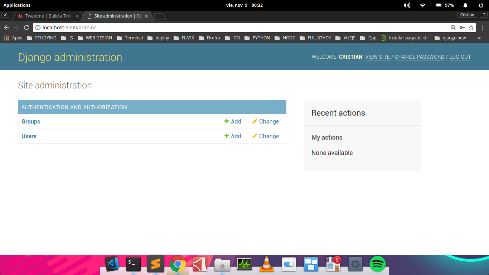
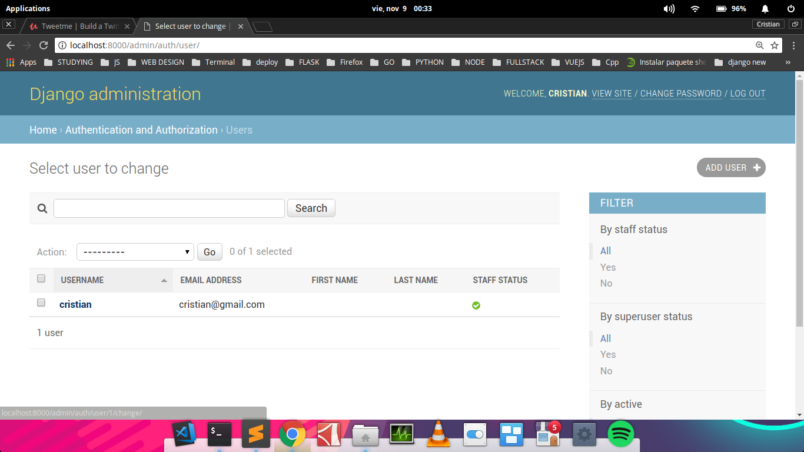
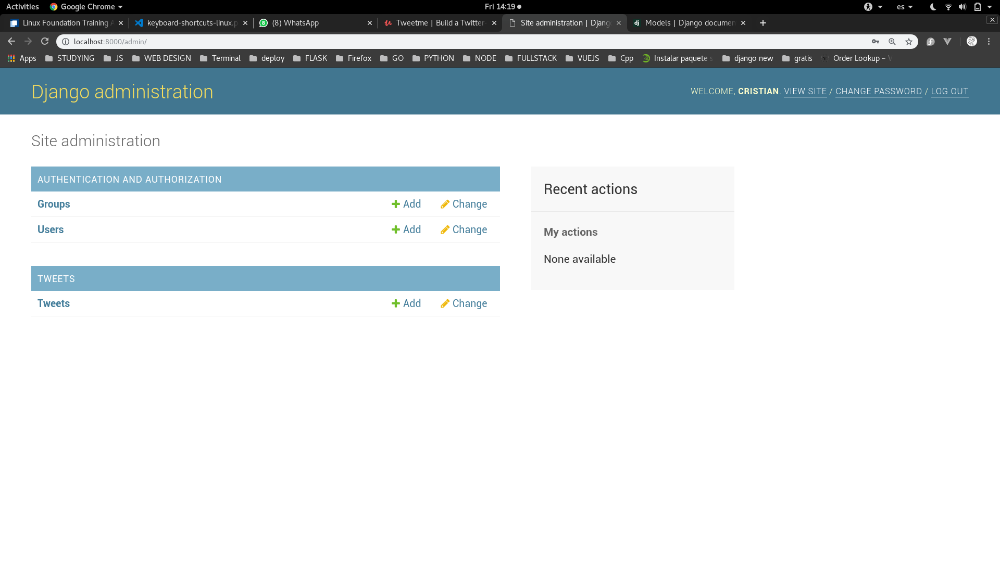
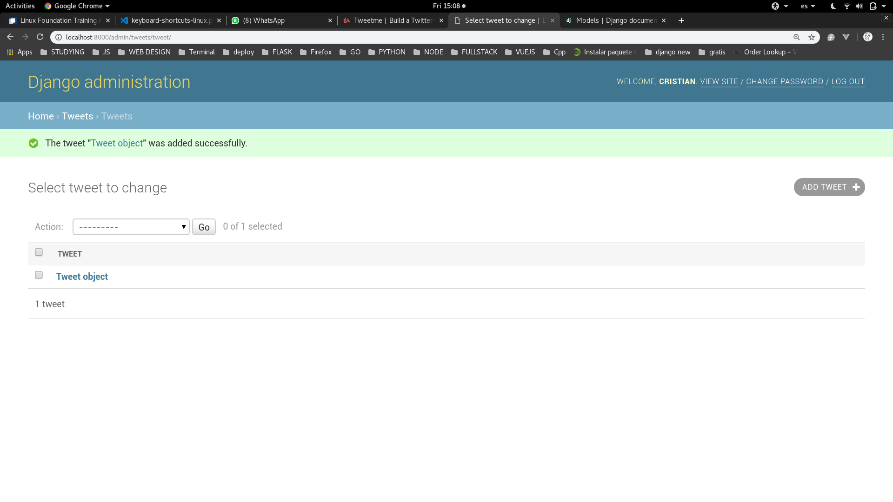
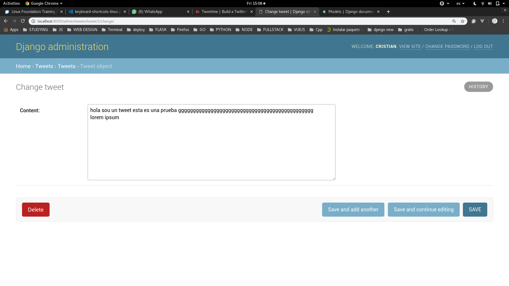

# Django creando una aplicacion: tweet

Ahora hemos visto algunas funcionalidades que podemos hacer con django, pero para crear una aplicacion como **tweeter** necesitamos mas cosas. Por ejemplo, una manera de crear usuarios para que posteen cosas. Esto lo haremos mediantes **apps** de la siguiente manera que veremos a continuacion.

## Como crear una aplicacion en Django

Lo haremos de la siguiente manera, ejecutando la siguiente sentencia en la consola:

```console
$ python manage.py startapp <nombre-de-la-aplicacion>

# en este caso la aplicacion se llamara "tweets" asi que se veria de la siguiente manera:
$ python manage.py startapp tweets
```

Una vez creada la **"app"** vamos a ver como django crea una carpeta dentro de la cual vamos a trabajar nuestra app (una buena practica es hacer varias aplicaciones pequeñas que se encargue nde tareas particulares en vez de tener una app grande). Asi que haremos que esta app solo se encargue de manejar los tweets.

Ahora, vamos a ver que se creo dentro de la carpeta **"tweets"**:

```console
$ tree tweets

tweets
├── admin.py
├── apps.py
├── __init__.py
├── migrations
│   └── __init__.py
├── models.py
├── tests.py
└── views.py
```

Pero antes de seguir vamos a hacer una pausa y veremos algo de django.

## Inspeccionando el ADMIN de Django

En especifico la secciond de **users**:







Aqui podemos ver los campos que existen y que podemos usar para configurar un usuario ya existente, o podriamos tambien crear uno. Esta es una de las ventajas de Django, el que ya exista una manera prefabricada de manejar a los usuarios y tal. Ahora nosotros con nuestra aplicacion **"tweets"** vamos a manejar valga la redundancia los tweets que los usuarios vayan a hacer y nada mas que eso.

Asi que ahora vamos a empezar a construir nuestra aplicacion y para esto necesitamos como guardar nuestra informacion y poder acceder a esta. Asi que esto sonara como un tema para las bases de datos cosa que es cierto. Pero en Django se maneja distinto. Y eso lo vamos a ver a continuacion.


## Construyendo nuestro primer modelo

En django un modelo, vendria a ser la parte de las bases de datos pero sin usar sentencias **SQL** mas bien estariamos usando el **ORM** de django. Puede que luego hable mas o haga un documento entero de que es un ORM y como funciona.

Pero por ahora solo dire que es una manera de manejar bases de datos usando objetos y mediante el lenguaje de programacion **Python** puede que suene confuso pero a continuacion veremos mas acerca de esto.

Y para empezar a configurar nuestro modelo entraremos a la aplicacion exactamente al archivo **models.py** y este archivo tendra o debe tener lo siguiente:

```python
from django.db import models

# Create your models here.


```

Y insertaremos lo siguiente:

```python

class Tweet(models.Model):
    content = models.TextField()


```

Y que significa esto ? Bueno es realmente codigo **Python**.

Estamos creando una clase **Tweet** que hereda de **Model**(una clase especifica de django por eso la importamos como **django.db**). Y inicializamos una variable **content** para que sea un campo de nuestra base de datos, pero como no queremos limitar su espacio la especificamos como **TextField** una subclase de **models**.

**models** tiene muchas subclases o propiedades para todo tipo de acciones si quieren saber mas vean en la documentacion. 
Como soy chevere se las dejare aqui [link](https://docs.djangoproject.com/es/2.1/topics/db/models/)

Ahora, si tienen nociones de python y entendieron bien el codigo. Podran notar que no he inventado nada no he creado nada, solo he importado y usado propiedades por defecto de Django.

Por ahora dejemoslo asi, solo crearemos un campo para nuestro modelo. Y vamos a ver como cambia o que ocasiona en nuestro proyecto como tal. Para esto debemos conectar nuestra aplicacion al proyecto y como haremos esto ?. A  continuacion.

## Agregando nuestra aplicacion al proyecto

Para hacer esto debemos agregar nuestra aplicacion a nuestro archivo de configuracion **local.py** (o el que estemos usando). Y lo pondre es nuestra propiedad **INSTALLED_APPS** en general. Pero como en mi caso yo dividi mis aplicaciones en tres lo pondre especificamente en mi lista llamada **CUSTOM_APPS** de la siguiente manera:

```python
CUSTOM_APPS = [
    'tweets',
    # podemos ponerlo asi o asi
    # 'tweets.apps.TweetsConfig'
]
```

Y esto sirve para que Django pueda reconer esta aplicacion como parte del proyecto. 

**Nota:**
Una aclaracion llamamos **aplicaciones o apps** a los componentes que estamos creando. Osea podriamos decirlas **components** pero diciendo **apps** es mas facil de recordar.


Ahora una vez hecho esto, tenemos que hacer actualizar las bases de datos para que django agregue los modelos creados en nuestra aplicacion y para esto haremos lo siguiente en la terminal:

```console
$ python manage.py makemigrations
# NOS DEBERIA DE SALIR ALGO ASI
Migrations for 'tweets':                     
│  tweets/migrations/0001_initial.py:         
│    - Create model Tweet

# Y LUEGO EJECUTAREMOS ESTO
$ python manage.py migrate
Operations to perform:
│  Apply all migrations: admin, auth, contentty
│pes, sessions, tweets
│Running migrations:
│  Applying tweets.0001_initial... OK   
```

Luego de hacer esto volvemos a correr el servidor.

Como ya hemos agregado nuestros modelos vamos a seguir trabajando en nuestra aplicacion. Ahora en el archivo **admin.py** haremos lo siguiente:

```python
from django.contrib import admin

# Register your models here.
from .models import Tweet

admin.site.register(Tweet)
```

Una vez hecho esto revisaremos nuestro **admin** de Django. 



Como podemos ver ahora hay una nueva ventana llamada **TWEETS** con una propiedad **Tweets**.

Y podemos ver dentro de esta propiedad:



Y creamos un tweet:



Pero como podemos ver cuando creamos un **Tweet** este aparece como 
**Tweet Object** y si queremos que cambie pondremos esto:

```python

    def __str__(self):
        return "{}. {}".format(self.id, self.content[:20])
```

Y quedaria asi:

```python
from django.db import models

# Create your models here.

class Tweet(models.Model):
    content = models.TextField()

    def __str__(self):
        return "{}. {}".format(self.id, self.content[:20])
```

