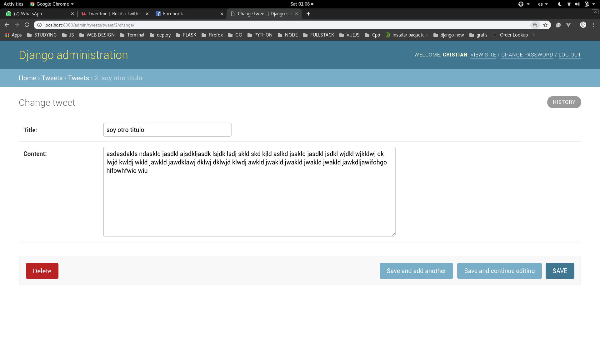
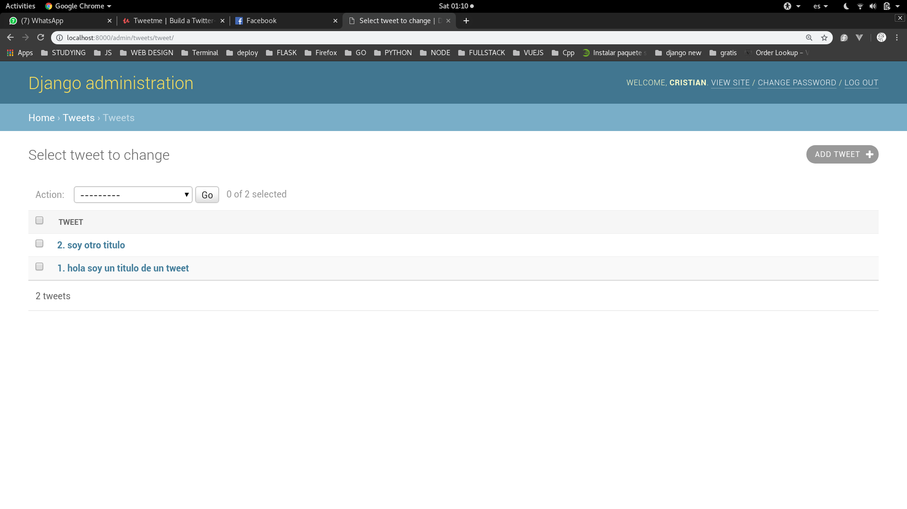

# Django Field Types

Vamos a ver un poco mas de los **tipos de campos** en la documentacion podremos ver un poco mas con este [link](https://docs.djangoproject.com/es/2.1/ref/models/fields/#field-types)

Por ejemplo el **AutoField** se refiere al **id** que usamos hace poco. Este sera un campo que se va a autoincrementar cada vez que cree un nuevo **tweet**.

Por ejemplo tenemos un **CharField** que se diferencia del **TextField** en que tiene una restriccion de caracteres que nosotros podemos poner. Por ejemplo si queremos tener un titulo en el **Tweet** podemos ponerle una restriccion de que no tengo mas de 80 caracteres y lo hariamos de la siguiente forma:

```python
class Tweet(models.Model):
    title = models.CharField(max_length=50)
    content = models.TextField()
```

Ahora vamos a agregar un par de campos para saber un poco mas los tiempos de creacion de los tweets:

```python
class Tweet(models.Model):
    title = models.CharField(max_length=50)
    content = models.TextField()
    created_at = models.DateTimeField(auto_now_add=True)
    updated_at = models.DateTimeField(auto_now=True)
```

Ahora que acabamos de crear? Pues hemos creado dos campos que van a hacer los siguiente:

- **created_at:** Nos va a guardar el momento exacto en que se creo el tweet.
- **updated_at:** Nos va a guardar la fecha de cada vez que actualizemos el tweet o cada vez que modifiquemos algo (entonces este sera igual a **created_at** cuando lo creamos por primera vez pero se ira actualizando cada vez que lo modifiquemos).

Y como hemos hecho cambios en nuestros modelos tenemos que hacer las migraciones correspondientes:

```console
$ python manage.py makemigrations
```

Y nos saldria algo como esto:

```console
You are trying to add the field 'created_at' with 'auto_now_add=True' to tweet without a default; the database needs something to populate existing rows.

 1) Provide a one-off default now (will be set
 on all existing rows)
 2) Quit, and let me add a default in models.p
y
Select an option:

```

Y para solucionar esto vamos a escojer la opcion **1**, y luego de apretar la opcion uno nos saldria algo como esto:

```console
│
│ 1) Provide a one-off default now (will be set
│ 2) Quit, and let me   
│y
│Select an option: 1
│Please enter the default value now, as valid P
│ython
│You can accept the default 'timezone.now' by p
│ressing 'Enter' or you can provide another val
│ue.
│The datetime and django.utils.timezone modules
│ are available, so you can do e.g. timezone.no
│w
│Type 'exit' to exit this prompt              
│[default: timezone.now] >>> timezone.now  
```

Y pondriamos lo siguiente como se puede apreciar:

```console
>>> timezone.now
```

Y ya con esto se debe haber solucionado el problema. Y ya podriamos acabar de hacer la migracion:

```console
$ python manage.py migrate
```

Y ahora volveremos a correr el servidor. Y podemos ver como ha cambiado:






Ahora solo nos muestra el id junto con el titulo y cuando entramos al tweet nos pide seteat un titulo y su contenido.

Ahora como queremos hacer un clon de twiter vamos a crear un campo de contenido tal y como esta hecho ahi. Osea que el contenido se limite a 140 caracteres. De la siguiente manera:

```python
class Tweet(models.Model):
    content = models.CharField(max_length=140)
    created_at = models.DateTimeField(auto_now_add=True)
    updated_at = models.DateTimeField(auto_now=True)


    def __str__(self):
        return "{}. {}".format(self.id, self.content[:20])
```

Y lo actualizaremos como ya hemos visto.


Ahora nos falta un detalla mas uno muy imporante. El asociar un tweet con un usuario, porque por obvias razones no deberia poder existir un post si no hay quien lo escriba, si no tiene un creador. Asi que lo siguiente que veriamos sera **"como asociar un tweet a un usuario"**.

