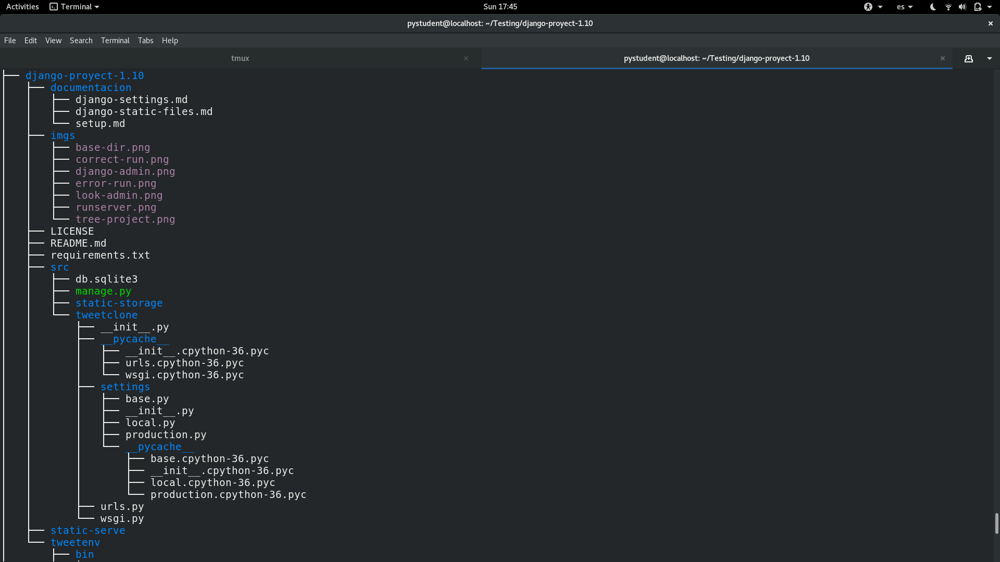
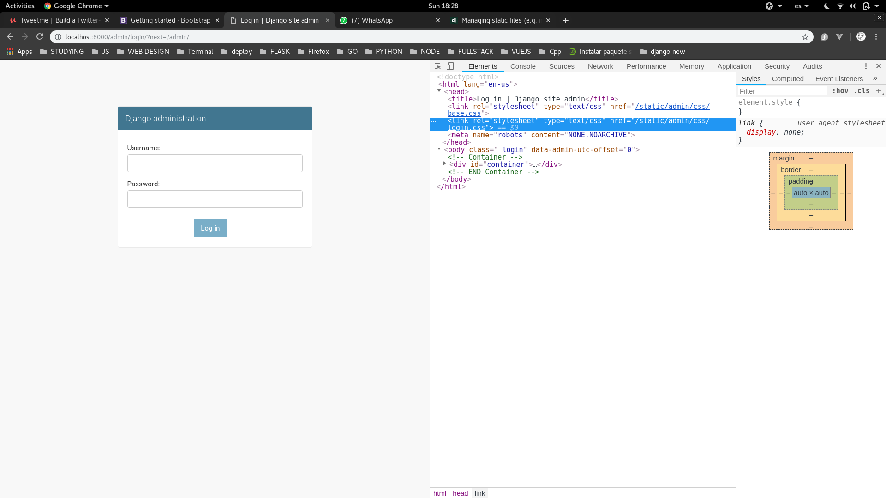
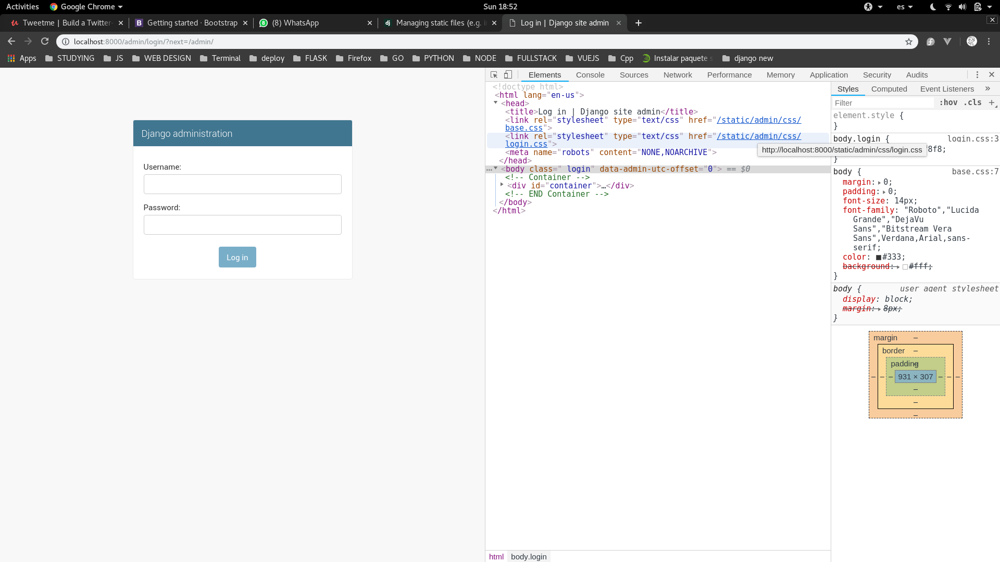
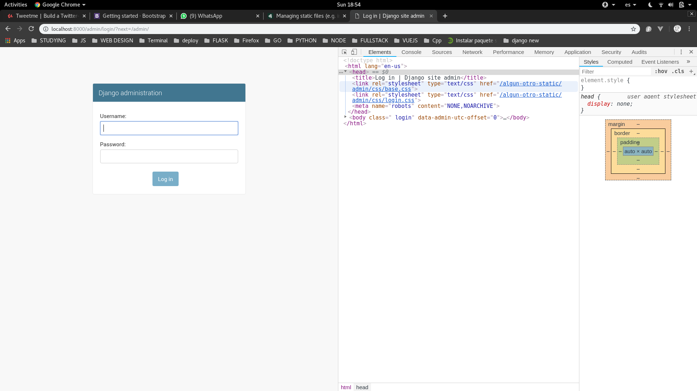

# Django sirviendo archivos estaticos

Aqui vamos a ver como hace django para manejas los archivos estaticos. Cabe mencionar que con archivos estaticos hablamos de css, js, html que sera servido. 
En estas alturas ya deberiamos tener nuestros archivos de configuracion creados y funcionando. Asi que para aclarar todo lo que vamos a trabajar sera en **local.py**.

**Django** como tal ya tiene documentacion acerca de esto como podemos ver en el siguiente pedazo de codigo que tenia nuestro **settings.py**:

```python

# Static files (CSS, JavaScript, Images)
# https://docs.djangoproject.com/en/1.10/howto/static-files/

STATIC_URL = '/static/'

```

Si quieres acceder a la documentacion de django 1.10 sobre [static files den click aqui](https://docs.djangoproject.com/en/1.10/howto/static-files/). Porque vamos a copiar buena parte de lo que este puesto en esa pagina en nuestro proyecto. 

Ahora, empezaremos a agregar cosas a nuestro **local.py** tales como:

- **STATIC ROOT**: Nos dice donde en donde van a acabar nuestros archivos estaticos. Esto generalmente lo usamos en produccion cuando tenemos un **CDN** (content delivery network) o cualquier otro servidor que maneje nuestros archivos estaticos.
Pero este metodo solo lo usaremos de manera **local** para probar una que otra cosa en este proyecto, pero **NO** debe ser usado en produccion porque es ineficiente y ademas **inseguro**. Sera servido.

- **STATICFILES_DIRS**: Aqui es donde los archivos existen al inicio y donde van a existir en el futuro. No sera servido, mas bien sera como un guardado a largo plazo.

```python
# ya debe existir STATIC_URL
STATIC_URL = '/static/'

STATICFILES_DIRS = [
    os.path.join(BASE_DIR, "static-storage")
]

STATIC_ROOT = os.path.join(os.path.dirname(BASE_DIR, "static-serve"))
```

Ahora para tener una mejor idea crearemos estos directorios manualmente de la siguiente manera:

```console
# para crear static-storage
$ pwd
/home/pystudent/Testing/django-proyect-1.10/src
$ mkdir static-storage

# y para crear static-serve
$ cd ..
$ pwd 
/home/pystudent/Testing/django-proyect-1.10
$ mkdir static-serve
```

Para una mejor referencia pondre la imagen del arbol de archivos actual:



Una vez hecho todo esto vamos a proceder a ejecutar el siguiente comando:

```console
$ ./manage.py collectstatic
```

Nos preguntara si queremos sobreescribir lo que contiene la carpeta y le diremos que si.
Y podremos ver como dentro de **static-serve** se creo una carpeta llamada **admin** que va a contener los archivos estaticos base que tiene **Django**.

Ahora si corremos el servidor podremos ver lo siguiente:



Que ahora cargamos los archivos **CSS** desde la ruta **/static/admin/css/"** 


Ahora haremos lo siguiente en el archivo **urls.py**:

```python
# agregaremos estas dos lineas
from django.conf import settings
from django.conf.urls.static import static 

urlpatterns = [
    url(r'^admin/', admin.site.urls),
]

if settings.DEBUG:
	urlpatterns += [static(settings.STATIC_URL, document_root=setting.STATIC_ROOT)]
```

Y correremos de nuevo el servidor, y podemos ver como no ha cambiado nada:



Pero si cambiamos 


```python
# ya debe existir STATIC_URL
STATIC_URL = '/algun-otro-static/'
```

Podemos ver como cambio el nombre de la ruta de static:





Ahora despues de haber hecho todo esto, podemos crear una carpeta dentro de **static-storage** llamada por decirlo asi **static** y crear o agregar archivos de la siguiente manera:

```console
$ pwd 
/home/pystudent/Testing/django-proyect-1.10/src/static-storage

$ mkdir static
$ cd static
$ mkdir css
$ cd css
$ touch example.css
```

Modificamos el archivo .css con cualquier cosa porque solo seria un ejemplo.
Y ahora hacemos recargar los archivos estaticos:

```console
$ python manage.py collectstatic
```

Y podremos ver como estos archivos estaticos fueron a parar en **static-serve**. Dentro de una nueva carpeta aparte de **admin**.

Debemos entender bien como es que **Django** maneja estos archivos y como los guarda porque eso nos servira de mucho luego en futuros proyectos. 


