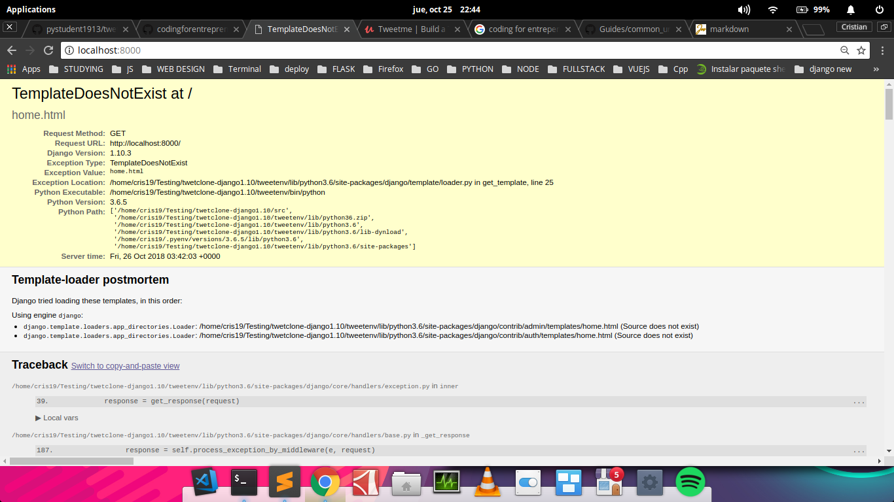
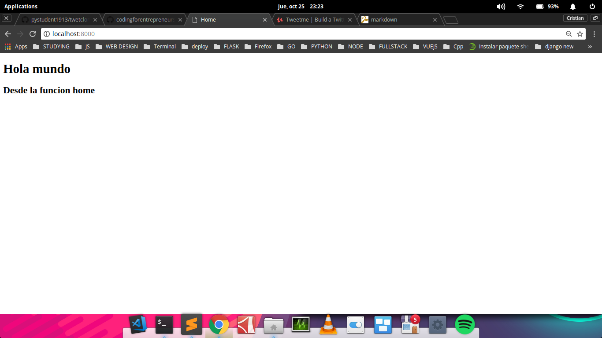

# Django: View-Functions y Renderizar templates

Ahora vamos a aprender como renderizar **html**. 

Y como herramienta usaremos **Bootstrap 3** para maquetar de manera mas rapida.


## Como vamos a trabajar esto ?

Para trabajar esto vamos a usar un archivo de de python llamado **view.py** en este caso no ha sido creado por defecto, asi que lo vamos a crear:

```console
$ pwd
/home/cris19/Testing/twetclone-django1.10/src/tweetclone
$ touch views.py
```
**Nota:** no es necesario llamar al archivo **views.py** pero esto es una convencion.


Una vez creado el archivo, haremos lo siguiente:

```python
from django.shortcuts import render

def home(request):
	context = {}
	return render(request, "home.html", context)
```

Esto hara que se renderize el template **home.html** cuando se llame esta funcion. Y el contexto sera algo muy util que veremos mas a profundidad adelante, por ahora tomemoslo como las variables que estaran disponibles para su uso cuando renderizemos esta html.

Pero ahora tenemos un problema, tenemos la funcion **home** pero no la estamos llamando, asi que tecnicamente no hace nada.

## Como enlazamos nuestras vistas para que sean utilizadas?

Haremos esto desde el archivo **urls.py**.
Como? puedo importando esta funcion dentro de nuestro archivo **urls.py** para que lo enrute.

De la siguiente manera:

```python
from .views import home

urlpatterns = [
    url(r'^admin/', admin.site.urls),
    url(r'^$', home, name='home'),
]
```

Y quedaria asi el archivo entero: 
```python
from django.conf.urls import url
from django.contrib import admin


# agregaremos estas dos lineas
from django.conf import settings
from django.conf.urls.static import static 

# importaciones de vistas
from .views import home


urlpatterns = [
    url(r'^admin/', admin.site.urls),
    url(r'^$', home, name='home'),
]

if settings.DEBUG:
	urlpatterns += static(settings.STATIC_URL, document_root=settings.STATIC_ROOT)

```

Y luego de guardar esto, corremos el servidor, cuando decimos que corremos el servidor es que estamos haciendo esto:

```python
$ python manage.py runserver
```

Puede que en el futuro por tiempo no vaya a especificar que debemos correr.

Y una vez que lo corramos y entremos a nuestro **localhost** en el puerto que nos indique la terminal, podremos ver el siguiente error:



Y porque pasa esto?

Porque el **template** que queremos renderizar aun no existe. Asi que tenemos que crearlo.


Para hacer esto debemos hacer unas cuantas modificaciones a nuestro archivo de configuracion **local.py** (especificamente en el area **TEMPLATES**:

```python
TEMPLATES = [
    {
        'BACKEND': 'django.template.backends.django.DjangoTemplates',
        'DIRS': [os.path.join(BASE_DIR, "templates")],
        'APP_DIRS': True,
        'OPTIONS': {
            'context_processors': [
                'django.template.context_processors.debug',
                'django.template.context_processors.request',
                'django.contrib.auth.context_processors.auth',
                'django.contrib.messages.context_processors.messages',
            ],
        },
    },
]

```

Esto porque lo hacemos ? Para poder tener un folder justo en la ruta de **src** llamado **templates** el cual nos servira como ruta principal donde django buscara nuestros templates (talvez haga una grafica y la suba para tener un mejor entendimiento de como funciona esto).

Pero al punto que nosotros necesitamos, una vez creado esta carpeta (templates) vamos a crear un archivo llamado **home.html** el cual va a ser llamado por nuestra funcion cuando entremos a la url especificada. Y esto se hara de la siguiente manera:

```console
$ pwd
/home/cris19/Testing/twetclone-django1.10/src
$ mkdir templates
$ cd templates
$ touch home.html
```

Y dentro de **home** haremos un html basico diciendo un clasico **hola mundo**:

```html
<!DOCTYPE html>
<html>
<head>
	<meta charset="utf-8">
	<meta http-equiv="X-UA-Compatible" content="IE=edge">
	<title>Home</title>
	<link rel="stylesheet" href="">
</head>
<body>
	<h1>Hola Mundo</h1>
	<h2>Desde la funcion home</h2>
</body>
</html>
```

Ahora volveremos a correr el servidor, y veamos que pasa:





Ahora ya aprendimos como renderizar html desde un fichero con django. 

El siguiente paso seria integrar **Bootstrap 3** , **css** y **js**


