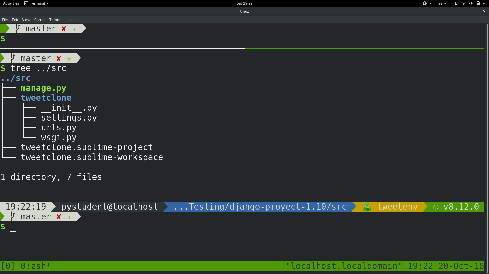
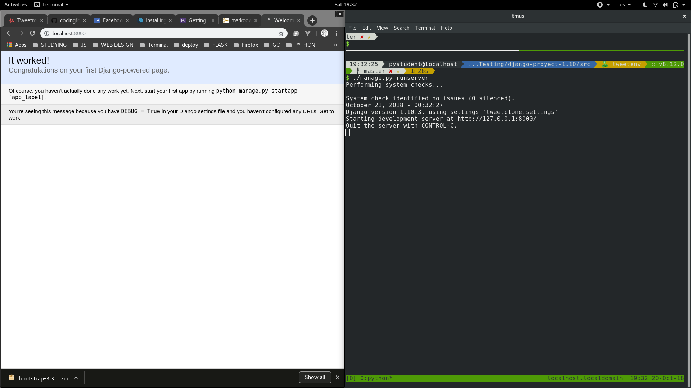
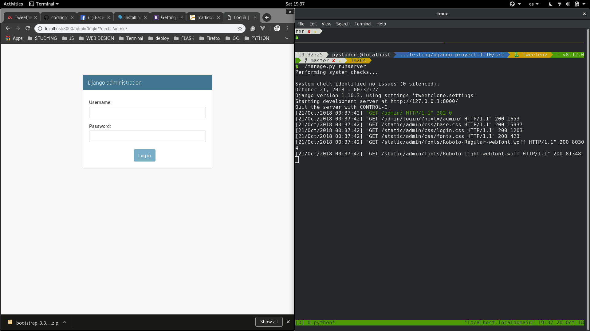
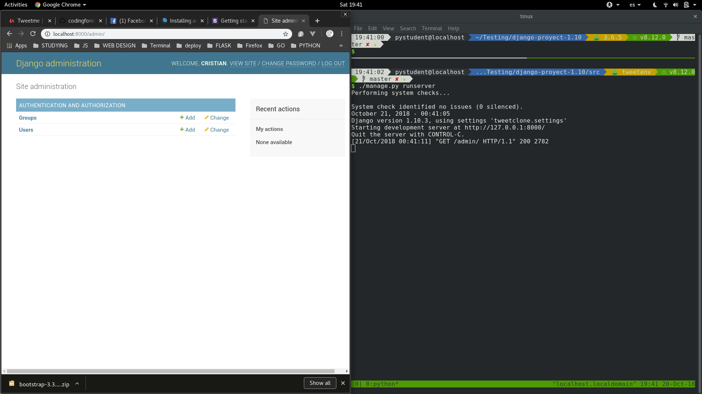

# Preparativos del proyecto

Para iniciar nuestro proyecto. Vamos a hacer lo siguiente.

## Crear el ambiente de python para django

Para este proyecto usaremos **virtualenvironment**:

```console
$ virtualenv -p python3 tweetenv
```

Y luego activamos el script como ya deberian saber... pero por si acaso:

```console
$ source tweetenv/bin/activate
```

Y crearemos una carpeta llamada **src** para que contenga todo nuestro proyecto en django asi que haremos lo siguiente (si estamos en el mismo directorio):

```console
$ mkdir src && cd src
```

Ahora instalaremos django, exactamente la version **1.10.3**:

```console
$ pip install django==1.10.3
```

Usamos el **==1.1.10.3** para especificar la version, porque si no especificamos nos instalaria la ultima version disponible de django.


## Una vez descargado Django usaremos los comandos principales

Para iniciar el proyecto haremos esto:

```console
## con el siguiente esquema
$ django-admin.py startproyect <nombre-del-proyecto> <carpeta-que-contiene-el-proyecto>

$ django-admin.py startproyect tweet-clone .
```
En caso de no especificarla django crearia una carpeta con el mismo nombre que contenga a django.

Ademas que la carpeta que estamos creando vendria a ser el **root del proyecto de django**.


Luego de crear nuestro proyecto y ver lo que hemos creado:




Vamos a realizar las migraciones correspondientes con el siguiente comando:

```console
$ python manage.py migrate
# y como usamos un ambiente virtual podemos correrlo de la siguiente manera
$ ./manage.py migrate
```

## Y podremos correr nuestro servidor por primera vez

Con este comando: 

```console
$ python manage.py runserver
```


Y nos saldria lo siguiente (si entramos a nuestro **localhost**):




Podemos acceder a la seccion **admin** de nuestro proyecto (con la siguiente direccion: http://localhost:8000/admin/login/?next=/admin/):




Ahora, crearemos un superusuario para nuestra aplicacion para entrar a la seccion admin de nuestro proyecto (que se crea automaticamente por django y que es de **SUMA IMPORTANCIA**), de la siguiete manera:

```console
$ python manage.py createsuperuser
# y nos desplegara una serie de instrucciones que debemos seguir
```

Ahora si podremos acceder a nuestro **Django administration** y se vera asi:




## Algo importante cuando trabajemos con PYTHON y PIP

Debido a que con pip vamos a instalar ciertos paquetes externos o **frameworks** como tal, necesitamos tener un control de que estamos usando. Y lo tendremos con el siguiente comando:

```console
$ pip freeze > requirements.txt
```

Esto que hace ? Nos crea un archivo llamado **requirements.txt** e inserta todos los paquetes que tenemos instalados en el ambiente virtual (si trabajamos en uno) o  el total de paquetes de python que tenemos instalados. 
Y para usarlo de prueba vamos a ver que imprime el sguiente comando y porque debemos usar **> requirements.txt**:

```console
$ pip freeze
Django==1.10.3
```


