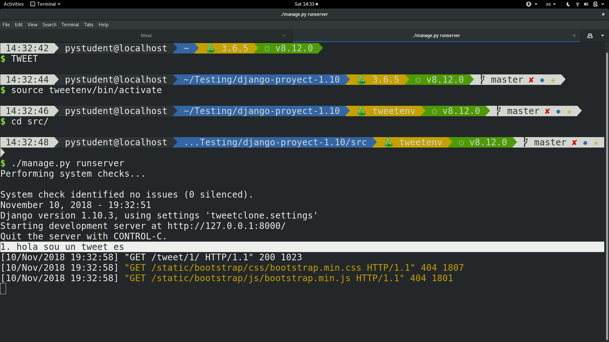
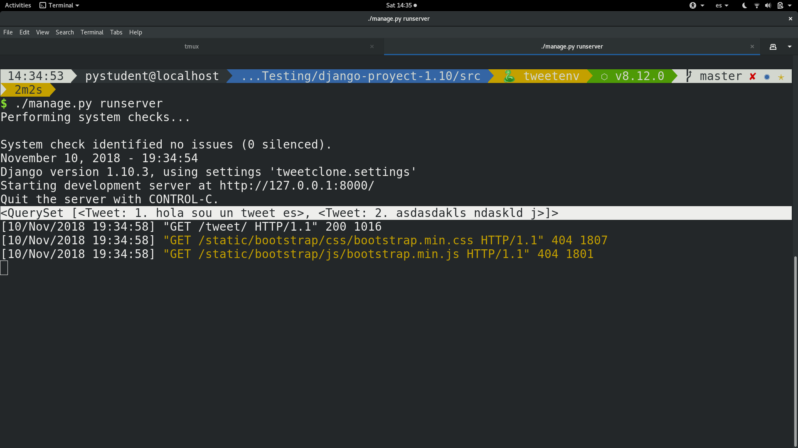
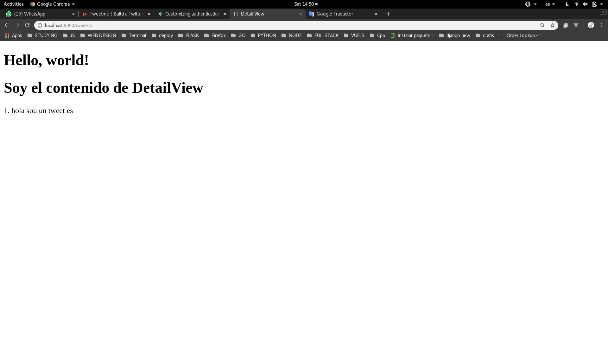
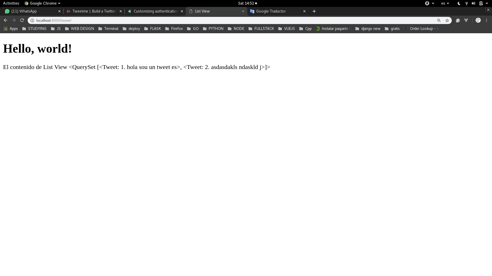
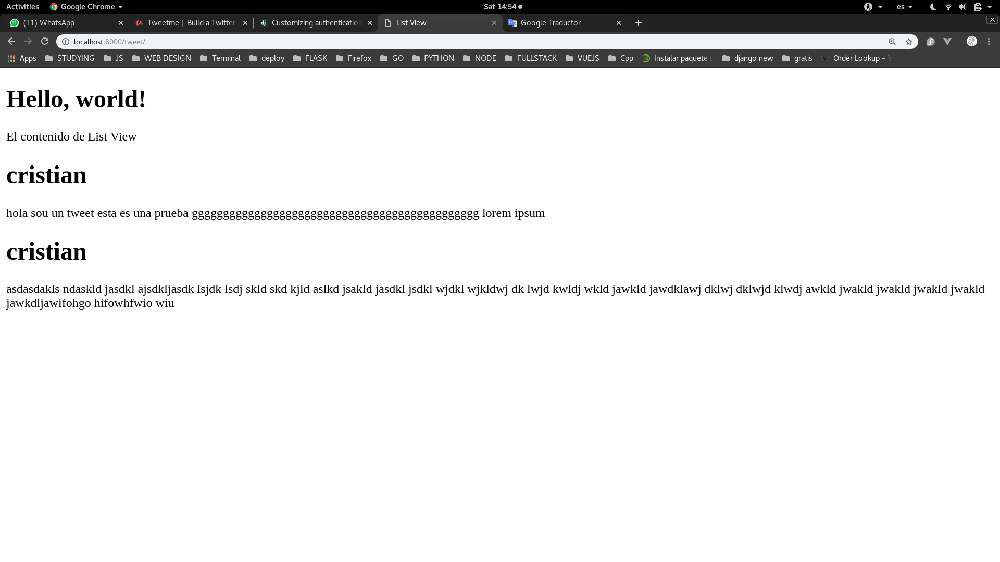

# Haciendo consultas en la Dase de Datos desde Django

Vamos a usar de ejemplo la vista READ.

Ahora, para usar los datos de la base de datos en Django. Debemos **importar** literalmente el modelo que creamos, esto pude sonar confuso pero a continuacion lo veremos:

```python
from django.shortcuts import render

# importamos el modelo
from .models import Tweet

def tweet_detail_view(request, id=1):
    obj = Tweet.objects.get(id=id)
    context = {
        'object': obj
    }
    return render(request, "tweets/detail_view.html", context)


def tweet_list_view(request):
    queryset = Tweet.objects.all()
    context = {
        'object_list': queryset
    }
    return render(request, "tweets/list_view.html", context)
```

Ahora vamos a proceder a explicar el codigo:

```python
# Que hace esto?
obj = Tweet.objects.get(id=id)
```

La sentencia **Tweet.object.get(id=id)** hace una consulta a la base de datos por especificamente su **id**. Es decir el objeto **Tweet** tiene un metodo llamado **objects** que nos permite hacer consultas de diferentes maneras y usamos el metodo **get** para hacer la consulta a la base de datos cuando le pases un id en especifico.

Ahora esto mismo pasas con **list_view**:

```python
# Que hace esto?
queryset = Tweet.objects.all()
```

Solo que esta vez no usamos el metodo **get** sino **all** para que nos de toda la lista de datos que tiene la base de datos.

Ahora una vez que tenemos la informacion de la base de datos.
Debemos hacer que se envie al template y lo vamos a hacer con el atributo **context**, ese atributo que siempre enviabamos como tercer parametro dentro de render pero no sabiamos que hacia. Pues ahora vamos a saber que hace.

Como ahora no tengo una imagen para hacer ejemplo voy a describirlo (xd), django cuando renderiza un template no solo envia el html sino crea una especia de ambiente dentro del cual pueden vivir variables y el que variables van a ser enviadas al html sera manejado por el **context** en una **function view**. Asi que lo que en realidad significa esta linea de codigo:

```python
return render(request, 'tweets/list_view.html', context)
```

Es que en el primer argumento enviamos el objeto **request** el cual no proveera de los metodos **HTTP** de los cuales hablaremos luego. Como segund argumento la ubicacion del documento **html**, y en tercer lugar enviaremos el diccionario **context**. Asi que todo lo que guardemos en **context** va a ser enviado al template y podremos mostrarlo. Pero para mostrarlo django tiene una forma especial que veremos mas adelante. Por mientras haremos un atajo para verlo desde consola de la siguiente manera:

```python
from django.shortcuts import render

# importamos el modelo
from .models import Tweet

def tweet_detail_view(request, id=1):
    obj = Tweet.objects.get(id=id)
    print(obj)
    context = {
        'object': obj
    }
    return render(request, "tweets/detail_view.html", context)


def tweet_list_view(request):
    queryset = Tweet.objects.all()
    print(queryset)
    context = {
        'object_list': queryset
    }
    return render(request, "tweets/list_view.html", context)
```

Una vez que ponemos los **prints** vamos a correr el servidor y entraremos a los siguientes links:

- http://localhost:8000/tweet/1/: para ver que nos devuelve el **Detail View**



- http://localhost:8000/tweet/: para ver que nos devuelve el *List View**




Como podemos ver la informacion si fue devuelta. Ahora vamos a ver como hacer que esa informacion sea puesta en nuestro template para que el usuario pueda verla.

**NOTA**:

Como pudieron ver en queryset es una lista de varios elementos, para ser especifico objetos. Asi que podemos iterara con respecto a la informacion que nos devuelve **queryset** (la cual serian los atributos de nuestro modelo **Tweet**) esto lo vamos a ver mejor mas adelante.


## Ahora vamos a ver como imprimir la informacion que nos devuelve el objeto context

Primero vamos a ver como imprimiriamos la informacion en **detail-view**:

```html



    Detail View



    <h1>
        Soy el contenido de DetailView
    </h1>

    <p>{{ object }}</p>

```
Y su resutlado seria:




Como vemos lo unico que cambio fue que agregamos **{{ object }}** y pues es esta la sintaxis que usaremos en django para usar la variable que esta en ese ambiente mandado por el context. Osea si hubiera cualquier otro dato en context por ejemplo:

```python
context = {
    'object' = obj,
    'hola' = 'hola como estas'
}
```

Lo renderizaremos de la siguiente manera:

```html
{{ hola }}
```

Ahora veremos como hacer en DetailView que como dijimos devuelve una lista:

Ahora si hacemos lo mismo que en DetailView

```html



    List View



    El contenido de List View

    {{ object_list }}

```

Pasaria lo siguiente:



Pero lo que nosotros queremos es acceder a los atributos de cada uno de los elementos de la lista asi que haremos esto:

```html



    List View



    El contenido de List View

    
        <h1>{{ item.user }} </h1>
        <p>{{ item.content }} </p>
    

```


Y ahora tendriamos lo siguiente:



Se que hay cosas nuevas que no entienden de lo que hice pero lo explicare mas a fondo cuando hable acerca de las propiedades de django en los templates.
