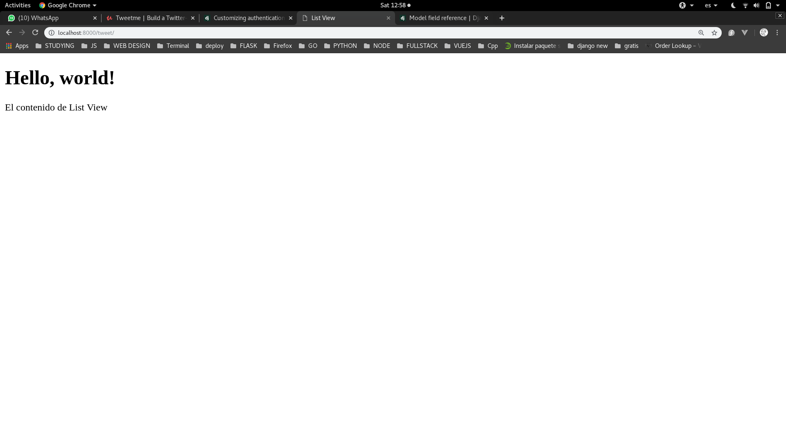
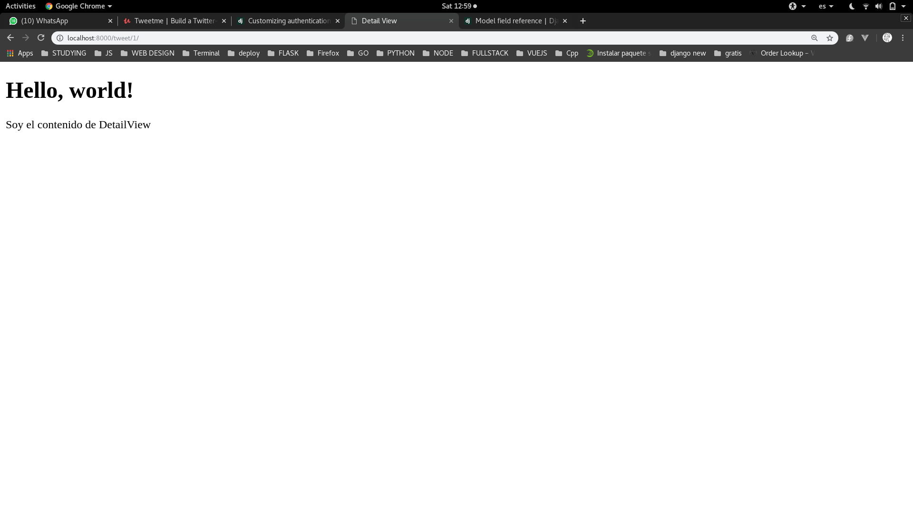

## Primero la vista READ

Como hemos vistos antes ya creamos una vista **home** anteriormente:

```python
def home(request):
    context = {}
    return render(request, "home.html", context)
```

Pero esta vista solo renderiza un template, lo que nosotros queremos es que renderize los **Tweets** que tenemos almacenados en nuestra base de datos. Y lo haremos de la siguiente forma:

Nota: a partir de ahora trabajaremos en el archivo **views.py** de nuestra aplicacion tweets.

```python
def tweet_detail_view(request, id=1):
    return render(request, "tweets/detail_view.html", context)


def tweet_list_view(request):
    return render(request, "tweets/list_view.html", context)
```

Una vez creadas nuestras dos vistas (basadas en funciones) **detail** y **list**. Vamos a tener que hacer que la aplicacion reconozca esta vista. Enrutando estas vistas mediante una **url** en nuestro archivo **urls.py**, pero como pueden ver en la aplicacion **tweets** no existe este archivo, asi que primero debemos crearlo:

```console
$ touch urls.py
```

```python
from django.conf.urls import url

from .views import tweet_detail_view, tweet_list_view

urlpatterns = [
    url(r'^1/$', tweet_detail_view, name='detail_view'),
    url(r'^$', tweet_list_view, name='list_view'),
]
```

Ahora debemos unir este archivo con el principal de la siguiente manera:

```python
from django.conf.urls import url, include

urlpatterns = [
    url(r'^tweet/', include('tweets.urls')),
]
```

Ahora si corremos el servidor en la siguiente url **http://localhost:8000/tweet/**.

Nos saldria un error diciendo que no existe el documento .html asi que haremos lo siguiente, porque en django los archivos estaticos dentro de una aplicacion son manejados de una manera especial:

```console
$ pwd
/home/pystudent/Testing/django-proyect-1.10/src//tweets
# siempre crearemos una carpeta llamada "templates"
$ mkdir templates
$ cd templates
# Y crearemos otra carpeta llamada como la aplicacion
$ mkdir tweets
$ cd tweets
# y una vez dentro crearemos los documentos
$ touch {detail_view,list_view}.html 
```

Porque hacemos esto ?

Porque django cuando busca los archivos estaticos y templates busca por defecto la carpeta **templates** y su contenido lo agrupa junto con las demas aplicaciones. Asi que para que no se nos mezclen y tener mas orden creamos una carpeta que contenga todo los templates de nuestra aplicacion en especifico.

Ahora que hemos creado los documentos vamos a darle unas configuraciones iniciales usando propiedades de django:

- **Primero haremos que todos hereden de nuestro documento home asi que lo cambiaremos un poco**

```html


<!DOCTYPE html>
<html lang="en">
  <head>
    <meta charset="utf-8">
    <meta http-equiv="X-UA-Compatible" content="IE=edge">
    <meta name="viewport" content="width=device-width, initial-scale=1">
    <title>  </title>
    <!-- Bootstrap -->
    <link href="" rel="stylesheet">
    <!-- Latest compiled and minified CSS
    <link rel="stylesheet" href="https://maxcdn.bootstrapcdn.com/bootstrap/3.3.7/css/bootstrap.min.css">
    -->
  </head>
  <body>
    <h1>Hello, world!</h1>
    
    
    
    <!-- jQuery (necessary for Bootstrap's JavaScript plugins) -->
    <script src="https://ajax.googleapis.com/ajax/libs/jquery/1.12.4/jquery.min.js"></script>
    <!-- Include all compiled plugins (below), or include individual files as needed -->
    <script src=""></script>
    <!--<script src="https://maxcdn.bootstrapcdn.com/bootstrap/3.3.7/js/bootstrap.min.js"></script>
    -->
  </body>
</html>
```

Y luego haremos los documentos respectivos:

- **Primero list_view**

```html



    List View



    El contenido de List View

```

- **Ahora detail_view**

```html



    Detail View



    Soy el contenido de DetailView

```

Podemos ver como los documentos **detail y list** son bastante cortos pero igual tienen varias propiedades como son el css y js de bootstrap. Esto es gracias a Django y sus templates incorporados que estamos usando. Por ahora no lo explicare a profundidad, luego hare un documento en especifico hablando de esto.

Ahora vamos a ver como se deberia ver hasta ahora:

- List view



- Detail view



Hasta ahora hemos visto una parte superficial de las vistas, hemos podido renderizar unas cuantas cosas etc. Pero aun no llegamos a nuestro objetivo. El leer la informacion de la base de datos y renderizarla junto con el template.

Esto lo vamos a ver mas en profundidad en el siguiente documento [link]() asi que recomiendo que lo lean al menos porque usare esta vista como ejemplo para hondar en este concepto.

Y ahora lo vamos a usar de forma practica:

